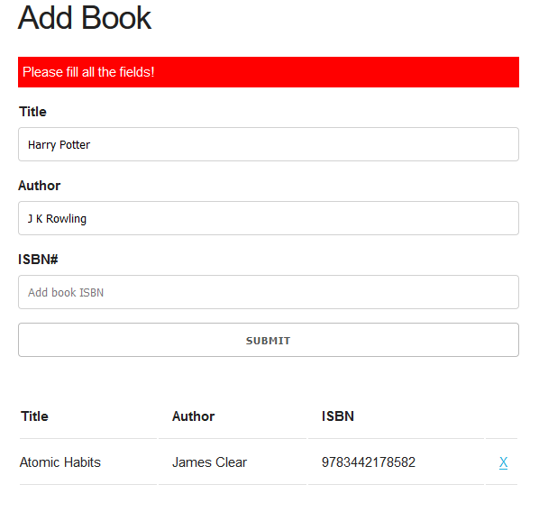

## Book-List 📚
`
This document provides an overview of Book-List 📚, detailing the features for adding, removing, and updating books using local storage.
`

### Screenshots

<ol>
  <li>Home Page  
    
  </li>
  <li>Added books shown with alert message "Book added"  
    
  </li>
  <li>
    Alert message about filling up unfilled field upon submission  
    
  </li>
  <li>
    After adding a shows"Book added!" for 3 seconds only  
    Shows all the books in Booklist  
     
  </li>
  <li>
    A book is removed with alert "Book Removed!" (for 3 sec) upon using 'X' button (allocated with each book in the list)  
    
  </li>
  <li>
    Updated booklist after page reload  
    
  </li>
</ol>

Thanks for your time :) 
 
